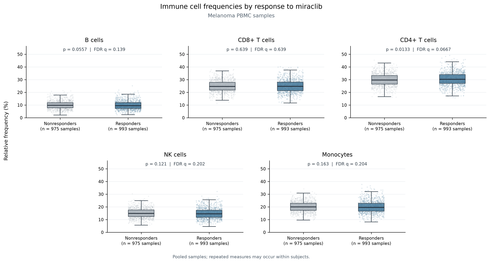

# Immune Cell Analysis: Technical Assessment

This project analyzes immune cell counts from a clinical trial to help understand how the drug candidate miraclib relates to immune composition. It loads `cell-count.csv` into a normalized SQLite database, calculates the relative frequency of five immune populations in every sample, compares miraclib responders and nonresponders with melanoma, and summarizes a baseline cohort. An interactive Streamlit dashboard presents the Part 2 to 4 results from the database the pipeline builds.

## Key Findings

- **Data:** 3 projects, 3,500 subjects, 10,500 samples (three per subject), and 52,500 cell population measurements.
- **Responders vs. nonresponders (pooled PBMC samples):** No population differed significantly after FDR correction (q < 0.05). CD4+ T cells came closest, with medians of 30.22% in responders and 29.66% in nonresponders (raw p = 0.0133, q = 0.0667). The effect size was small (rank-biserial = 0.064).
- **Change from Day 0 to Day 14:** B cells were the only population to pass q < 0.05 in any analysis. Responders' B cell share fell by a median of 1.00 percentage point, while nonresponders' rose by 0.15 (q = 0.0309). This is an exploratory result. See [Sensitivity analyses](#sensitivity-analyses).
- **Baseline cohort:** 656 melanoma, miraclib, PBMC samples at Day 0 from 656 subjects. 384 come from `prj1` and 272 from `prj3`.
- **Part 4 B cell average:** Male melanoma responders at Day 0, across all sample and treatment types, averaged **10206.15** B cells (485 samples from 485 subjects).

## How to Run

### GitHub Codespaces

Open the repository in a Codespace and run these commands from the root terminal:

```bash
make setup
make pipeline
make dashboard
```

| Command | What it does |
|---|---|
| `make setup` | Installs the Python packages listed in `requirements.txt`. |
| `make pipeline` | Runs `load_data.py`, `frequency_table.py`, `response_analysis.py`, and `subset_analysis.py` in order, and stops if any step fails. |
| `make dashboard` | Starts the Streamlit app in `app.py`, which reads the database created by the pipeline. |

After `make dashboard`, open the forwarded Streamlit port shown in the terminal. No notebook or manual database step is needed.

### Running locally

The same three commands work from the repository root on any machine with Python 3 and `pip`. All paths are relative to the repository.

## Dashboard

**Live dashboard:** PASTE_STREAMLIT_URL_HERE

To run it yourself, use `make dashboard` as described above.

## Design Decisions

I split the data into four tables (projects, subjects, samples, cell counts) so that subject attributes such as condition, sex, treatment, and response are stored once instead of being repeated for every timepoint. Storing cell counts in long format, with one row per sample and population, means a new cell population can be added without changing the schema.

For the responder comparison I used the Mann-Whitney U test, because it doesn't assume the percentages are normally distributed, and I applied Benjamini-Hochberg correction because five populations are tested at once. I report a rank-biserial effect size alongside each p-value so that a small but nominally significant difference isn't mistaken for a large one.

The question is framed at the sample level, so my primary comparison pools all PBMC samples. Each patient contributes three samples, though, so pooling counts the same person three times. I added subject-level analyses to check whether the results hold when each patient counts once.

## Project Structure

```text
.
├── Makefile                         # setup, pipeline, dashboard
├── requirements.txt                 # Python dependencies
├── README.md
├── cell-count.csv                   # source data (not modified)
├── inspect_data.py                  # optional data inspection
├── load_data.py                     # validates the CSV and builds the database
├── frequency_table.py               # Part 2 frequencies
├── response_analysis.py             # Part 3 tests, sensitivity analyses, figure
├── subset_analysis.py               # Part 4 cohort and B cell queries
├── app.py                           # Streamlit dashboard
├── .streamlit/
│   └── config.toml                  # dashboard theme
├── loblaw.db                        # created by make pipeline
└── outputs/                         # created by make pipeline
    ├── frequency_table.csv
    ├── response_analysis_results.csv
    ├── subject_mean_sensitivity_results.csv
    ├── baseline_sensitivity_results.csv
    ├── subject_change_sensitivity_results.csv
    ├── part4_cohort.csv
    ├── part4_samples_by_project.csv
    ├── part4_subjects_by_response.csv
    ├── part4_subjects_by_sex.csv
    └── figures/
        ├── response_frequency_boxplots.png
        └── response_frequency_boxplots.pdf
```

## Data

Each row of `cell-count.csv` is one sample, with raw counts for B cells, CD8+ T cells, CD4+ T cells, NK cells, and monocytes. The data follows a hierarchy of project, subject, sample, and cell population measurement.

- `project`, `subject`, `condition`, `age`, `sex`, `treatment`, and `response` describe the subject.
- `sample`, `sample_type`, and `time_from_treatment_start` describe each collection.
- The five count columns are the measurements within a sample.

Every subject has three samples. In the response cohort, they were collected on Days 0, 7, and 14. Response is blank only for healthy subjects, and those blanks are stored as `NULL`.

## Part 1: Data Management

`loblaw.db` has four related tables:

| Table | Key and fields | Relationship |
|---|---|---|
| `projects` | `project_id` (primary key) | One project has many subjects. |
| `subjects` | `subject_id` (primary key), `project_id`, `condition`, `age`, `sex`, `treatment`, `response` | `project_id` references `projects`. |
| `samples` | `sample_id` (primary key), `subject_id`, `sample_type`, `time_from_treatment_start` | `subject_id` references `subjects`. |
| `cell_counts` | (`sample_id`, `cell_type`) primary key, `cell_count` | `sample_id` references `samples`. One row per sample and population. |

The schema also enforces foreign keys, nonnegative counts, and one sample per subject, sample type, and timepoint. Indexes on the fields used for filtering and joins keep cohort queries fast as the data grows.

Before loading, `load_data.py` checks that the expected columns are present, that required fields have the right types, and that response values are valid. It also confirms that each subject has consistent metadata across samples, that sample IDs are unique, and that no counts are negative. It builds the new database in a temporary file and replaces `loblaw.db` only if loading succeeds. Rerunning it therefore produces the same database every time, without duplicate rows or manual cleanup.

## Part 2: Immune Cell Frequencies

**Question:** What is the frequency of each cell type in each sample?

For each sample, `frequency_table.py` calculates:

```text
total_count = sum of the five population counts
percentage  = count / total_count × 100
```

Percentages make samples with different total cell counts comparable. The output, `outputs/frequency_table.csv`, has the columns `sample`, `total_count`, `population`, `count`, and `percentage`, with **52,500 rows covering 10,500 samples**. The script checks that every sample has all five populations, that totals are positive, and that each sample's percentages add up to about 100%.

For example, `sample00000` has 10,908 B cells out of 93,214 total cells, or 11.70%.

## Part 3: Responders vs. Nonresponders

**Question:** Do relative immune cell frequencies differ between melanoma patients who respond to miraclib and those who don't?

The cohort is limited to `condition = melanoma`, `treatment = miraclib`, `sample_type = PBMC`, and a response of `yes` or `no`. It includes **656 subjects** (331 responders, 325 nonresponders) and **1,968 samples** (993 from responders, 975 from nonresponders). Each subject has one sample at Day 0, Day 7, and Day 14.

Results from `outputs/response_analysis_results.csv`:

| Population | Responder median (%) | Nonresponder median (%) | Rank-biserial | Raw p | FDR q | Interpretation |
|---|---:|---:|---:|---:|---:|---|
| B cells | 9.43 | 9.79 | -0.050 | 0.0557 | 0.1393 | Not significant |
| CD8+ T cells | 24.73 | 24.60 | -0.012 | 0.6391 | 0.6391 | Not significant |
| CD4+ T cells | 30.22 | 29.66 | 0.064 | 0.0133 | 0.0667 | Nominal only |
| NK cells | 14.51 | 14.80 | -0.040 | 0.1211 | 0.2018 | Not significant |
| Monocytes | 19.61 | 19.94 | -0.036 | 0.1632 | 0.2039 | Not significant |

**No population differs significantly after FDR correction.** CD4+ T cells pass p < 0.05 before correction, but the effect is small and does not hold up once all five tests are accounted for.



*Melanoma PBMC samples grouped by response. Each panel shows one population, with raw p and FDR q values. Each subject contributes three samples.*

### Sensitivity analyses

Because each patient contributes three samples, I repeated the comparison in three other ways:

1. **Subject mean:** each patient's average percentage across the three timepoints.
2. **Day 0 only:** one baseline sample per patient.
3. **Change from Day 0 to Day 14:** each patient's change in percentage points.

| Analysis | Population | Responder median | Nonresponder median | Raw p | FDR q |
|---|---|---:|---:|---:|---:|
| Subject mean | CD4+ T cells | 30.21% | 29.82% | 0.0124 | 0.0621 |
| Day 0 only | CD4+ T cells | 29.63% | 29.53% | 0.7964 | 0.8853 |
| Day 14 minus Day 0 | B cells | -1.00 pp | 0.15 pp | 0.00618 | 0.0309 |

The subject mean analysis gives the same picture as the pooled test: CD4+ T cells are nominally different, but not after correction. At Day 0 there is no difference in any population, so these data offer no baseline marker that predicts response.

The change in B cells from Day 0 to Day 14 is the one result that passes q < 0.05. I treat it as a lead worth following up rather than a conclusion, for two reasons. First, FDR correction was applied within each set of five tests, not across all 20 tests in the four analyses. Second, it describes a change during treatment, so it can't predict response before treatment starts. Full results for all five populations in each analysis are saved in `outputs/`.

## Part 4: Baseline Cohort

**Question:** Among melanoma PBMC samples at baseline (`time_from_treatment_start = 0`) from patients treated with miraclib, how many samples come from each project, and how many subjects are responders, nonresponders, males, and females?

`subset_analysis.py` selects **656 samples from 656 subjects**. Project counts are samples. Response and sex counts are subjects.

| Measure | Category | Count |
|---|---|---:|
| Samples by project | `prj1` | 384 |
| Samples by project | `prj3` | 272 |
| Subjects by response | Responders | 331 |
| Subjects by response | Nonresponders | 325 |
| Subjects by sex | Male | 344 |
| Subjects by sex | Female | 312 |

### Average B cells in male melanoma responders at Day 0

**Question:** Considering melanoma males of all sample and treatment types, what is the average number of B cells for responders at time 0?

The query filters on `condition = melanoma`, `sex = M`, `response = yes`, `time_from_treatment_start = 0`, and `cell_type = b_cell`. As the question specifies, it does not filter on sample type or treatment, so it includes both PBMC and WB samples and both miraclib and phauximab.

**Answer: 10206.15** B cells on average, from 485 samples and 485 subjects. This is a raw count, not a Part 2 percentage.

## Statistical Notes

- **Repeated samples:** The pooled test treats each patient's three samples as independent, which overstates the sample size. The subject mean and Day 0 analyses count each patient once.
- **Compositional data:** The five percentages in a sample always add up to 100%, so a rise in one population lowers the share left for the others. These results describe relative composition, not absolute cell numbers.
- **Baseline:** I follow the prompt in treating Day 0 as baseline. The data doesn't record whether Day 0 samples were drawn before the first dose.

## Limitations

These results are exploratory associations based on five immune populations and the recorded metadata. They don't show that miraclib causes any change in immune composition. I did not build or test a predictive model, so none of these results should be read as a validated predictor of response. Any candidate biomarker, including the B cell change, would need confirmation in an independent cohort.

## Outputs

| File | Contents |
|---|---|
| `loblaw.db` | SQLite database used by all analyses and the dashboard. |
| `outputs/frequency_table.csv` | Count, total, and percentage for every sample and population. |
| `outputs/response_analysis_results.csv` | Pooled responder vs. nonresponder comparison. |
| `outputs/subject_mean_sensitivity_results.csv` | Subject mean comparison. |
| `outputs/baseline_sensitivity_results.csv` | Day 0 comparison. |
| `outputs/subject_change_sensitivity_results.csv` | Day 0 to Day 14 change comparison. |
| `outputs/figures/response_frequency_boxplots.png` and `.pdf` | Boxplots for the pooled comparison. |
| `outputs/part4_cohort.csv` | Samples in the Part 4 baseline cohort. |
| `outputs/part4_samples_by_project.csv`, `outputs/part4_subjects_by_response.csv`, `outputs/part4_subjects_by_sex.csv` | Part 4 summary counts. |

## Reproducibility

`make pipeline` runs every analysis in order, starting from the original CSV. `load_data.py` rebuilds the database from scratch each time, and the other scripts overwrite their outputs, so rerunning the pipeline always gives the same results. The dashboard calls the same query and analysis functions as the pipeline instead of recalculating anything separately, so the numbers on screen always match the files in `outputs/`.